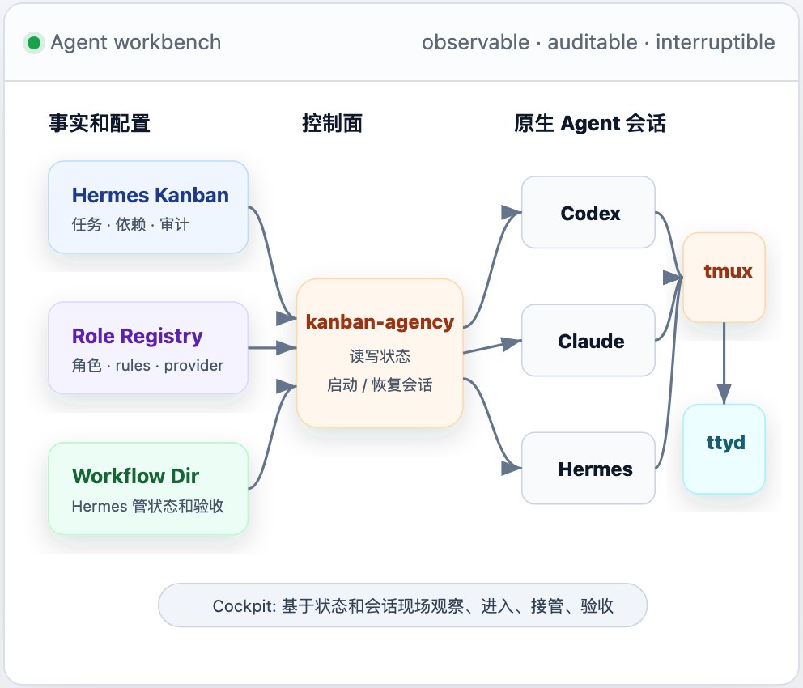
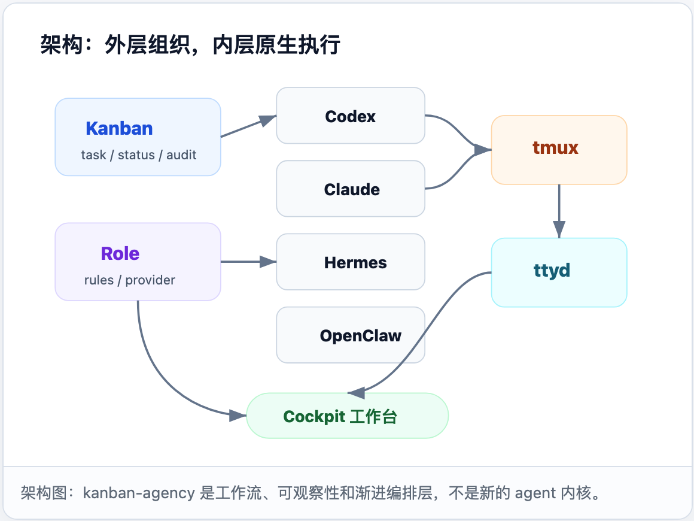
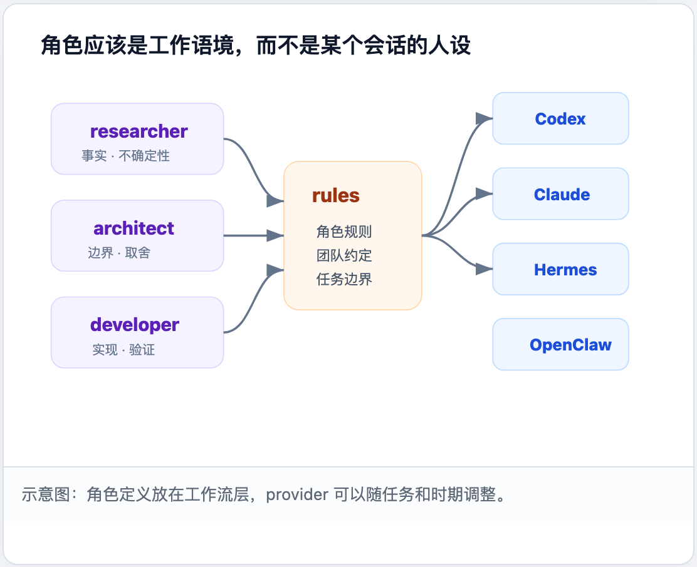
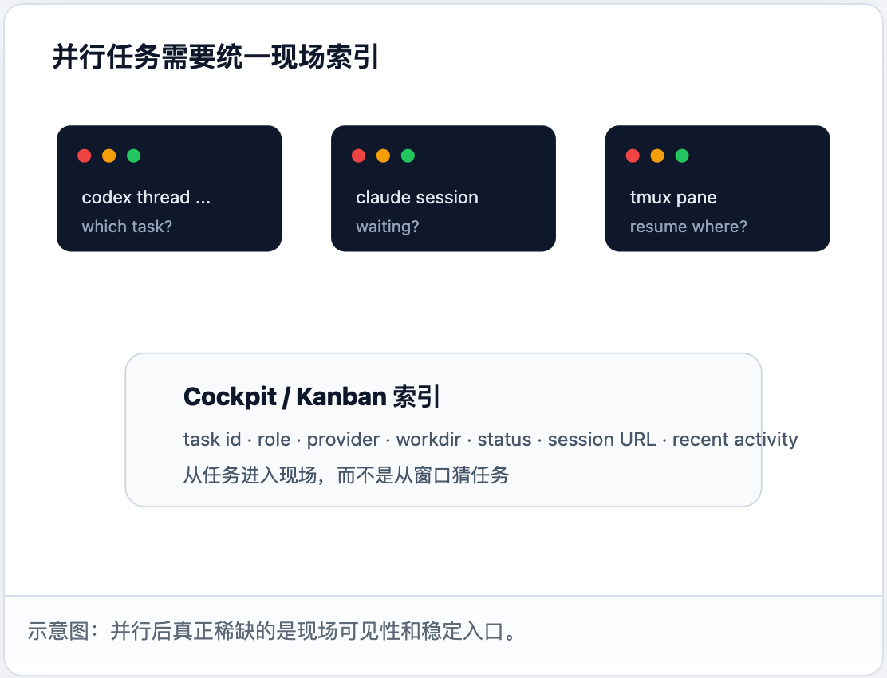
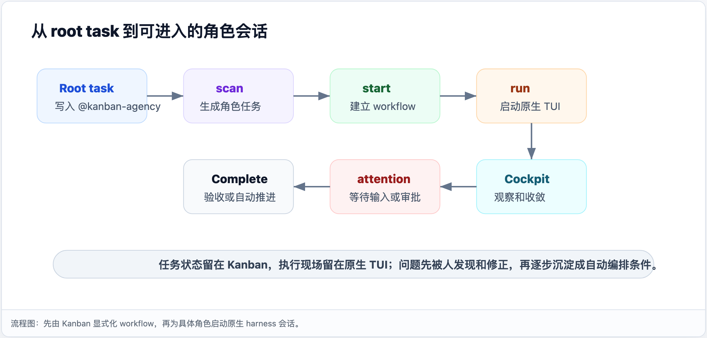

# Kanban Agency

[English](README.md) | [简体中文](README.zh-CN.md)

**A Hermes-native cockpit for trustworthy multi-agent software work.**

Kanban Agency turns [Hermes Agent](https://github.com/NousResearch/hermes-agent) Kanban tasks into auditable multi-agent workflows. It lets you split real work into roles such as analyst, architect, developer, tester, researcher, and ops; run each role in its own native Codex CLI, Claude Code, or Hermes session; and recover the whole execution surface from the Kanban board.

> Hermes Agent is the source of truth for tasks, dependencies, comments, and human acceptance. Kanban Agency adds role orchestration, tmux/ttyd session persistence, browser Cockpit control, and lifecycle hygiene around existing agent CLIs.



## Why Kanban Agency

Most AI coding work does not fail because there are too few agents. It fails because the work becomes impossible to supervise:

- one giant chat thread hides decisions and evidence,
- terminal sessions drift away from task state,
- role boundaries blur between planning, implementation, testing, and ops,
- agent completion is confused with human acceptance,
- old TUI sessions leak until the machine slows down,
- useful corrections stay trapped in chat history instead of becoming workflow rules.

Kanban Agency is the small engineering layer between "manual agent juggling" and "blind full automation". It keeps humans in the loop where judgment is still needed, while making every intervention observable, recoverable, and eventually automatable.

```text
Hermes Kanban root task
  -> role cards: analyst -> architect -> developer -> tester
  -> native agent sessions: Codex CLI / Claude Code / Hermes
  -> tmux persistence + ttyd browser panes
  -> comments, events, dependencies, Complete gates, session health
```

## Why Hermes matters

Kanban Agency is intentionally built around Hermes instead of inventing another workflow database:

| Hermes layer | Kanban Agency adds |
| --- | --- |
| Kanban boards, tasks, dependencies, comments | Role-aware multi-agent workflow structure |
| Durable task state and audit history | Native TUI session binding and recovery |
| Human-in-the-loop Complete gate | Browser Cockpit for observing and taking over live sessions |
| Hermes sessions, memory, skills, tools | A place to turn repeated human corrections into reusable role rules |

This makes the board the durable index for agent work: if a browser tab, terminal, or provider process disappears, the task still knows which role it represents, which provider thread it used, and how to resume it.



## Highlights

- **Hermes-native Kanban workflow** — tasks, comments, dependencies, and audit history stay in Hermes Kanban.
- **Role-based multi-agent flow** — precreate analyst -> architect -> developer -> tester lanes for feature work.
- **Native provider sessions** — run OpenAI Codex CLI, Anthropic Claude Code, or Hermes as real terminal/TUI sessions.
- **Browser Cockpit** — drag live role sessions into fixed panes and work without switching terminals.
- **tmux-backed persistence** — browser refreshes do not kill agent sessions; stopped sessions can be resumed from the task.
- **Attention signals** — Codex approvals and Claude/Hermes waiting states surface as bells/status badges.
- **Human acceptance gate** — an agent can finish a role, but downstream workflow waits for human Complete.
- **Recent activity index** — sort roots by real task/provider activity, not just creation time.
- **Session lifecycle hygiene** — stale completed sessions can be closed; orphan ttyd/tmux wrappers can be reported and cleaned.
- **Private role rules** — keep team/project instructions in your Hermes profile while publishing safe templates.



## What it feels like

```text
Cockpit

Recent
  Agent file upload                           🔔
    analyst     done       Codex
    architect   done       Codex
    developer   running    Codex
    tester      ready      Codex

Panes
  #1 developer Codex TUI
  #2 tester Codex TUI
  #3 ops Claude Code TUI
```

Each pane is a real:

```text
browser -> ttyd -> tmux -> codex / claude / hermes
```

You can inspect the live terminal, scroll tmux history, approve tool calls, paste fixes, mark the role Complete, and later reopen the same task if you need the evidence again.

## Design principles

- **Kanban remains the source of truth.** Role sessions are execution surfaces; task state lives in Hermes.
- **Native tools stay native.** Kanban Agency does not reimplement Codex, Claude Code, Hermes, tools, skills, or model runtime.
- **Human intervention is a feature, not a failure.** Early workflows should be observable and correctable before becoming automatic.
- **Complete is the safety boundary.** Provider completion does not automatically mean task acceptance.
- **Session recovery is mandatory.** Multi-agent work only scales when every live terminal can be traced back to a task, role, provider, workdir, and thread id.
- **Repeated corrections should become rules.** User rejection, supplementation, and steering are first-class signals for improving role prompts and workflow gates.



## Common use cases

- Feature delivery with separate analyst / architect / developer / tester roles.
- Long-running Codex or Claude sessions that must survive browser refreshes.
- Human-reviewed automation where agents draft, implement, and test, but humans decide when to advance.
- Research or ops workflows that need multiple independent agent terminals but still need task-level audit history.
- Teams experimenting with multi-agent automation without abandoning their existing Hermes, Codex, or Claude workflows.

## Requirements

- [Hermes Agent](https://github.com/NousResearch/hermes-agent) with `hermes_cli.kanban_db` importable
- Python 3.11+
- `tmux`
- `ttyd`
- OpenAI Codex CLI for `provider: codex`
- Anthropic Claude Code CLI for `provider: claude`

On macOS:

```bash
brew install tmux ttyd
```

## Install as a Hermes plugin

Kanban Agency is a Hermes plugin. The recommended installation path is Hermes' plugin manager, which clones the repository into your profile and lets Hermes enable/disable it consistently:

```bash
hermes plugins install <owner>/kanban-agency --enable
# or from a full Git URL:
hermes plugins install https://github.com/<owner>/kanban-agency.git --enable
```

For local development, install from a checkout by copying or symlinking it into your Hermes profile:

```bash
mkdir -p ~/.hermes/plugins
ln -s /absolute/path/to/kanban-agency ~/.hermes/plugins/kanban-agency
# or, if you prefer a copy:
# cp -R /absolute/path/to/kanban-agency ~/.hermes/plugins/kanban-agency
hermes plugins enable kanban-agency
```

Check status:

```bash
hermes plugins list --plain --no-bundled
hermes plugins enable kanban-agency
hermes plugins disable kanban-agency
hermes plugins update kanban-agency
```

Create private role config and rule files:

```bash
mkdir -p ~/.hermes/kanban-agency/rules
cp templates/roles.yaml.template ~/.hermes/kanban-agency/roles.yaml
for f in templates/rules/*.template; do
  name="$(basename "$f" .template)"
  cp "$f" "$HOME/.hermes/kanban-agency/rules/$name"
done
```

Edit your private config:

```text
~/.hermes/kanban-agency/roles.yaml
~/.hermes/kanban-agency/rules/*.md
```

Keep those files private. They usually contain project paths, team conventions, and internal instructions.

## Configure roles

Example role mapping:

```yaml
roles:
  analyst:
    provider: codex
    rules:
      - ~/.hermes/kanban-agency/rules/analyst.md
  architect:
    provider: codex
    rules:
      - ~/.hermes/kanban-agency/rules/architect.md
  developer:
    provider: codex
    rules:
      - ~/.hermes/kanban-agency/rules/developer.md
  tester:
    provider: codex
    rules:
      - ~/.hermes/kanban-agency/rules/tester.md
  ops:
    provider: claude
    rules:
      - ~/.hermes/kanban-agency/rules/ops.md
```

## Basic workflow

Create a Hermes Kanban root task whose body contains `@kanban-agency`:

```text
@kanban-agency
workdir: /absolute/path/to/project
workflow: functional-development

Build a visible thumbs-down feedback flow for the AI assistant.
```

Then run:

```bash
scripts/kanban-agency scan --board my_board
scripts/kanban-agency start --board my_board
scripts/kanban-agency run --board my_board --task-id t_xxx
```

For `workflow: functional-development`, Kanban Agency creates a fixed role chain:

```text
analyst -> architect -> developer -> tester
```

Later roles are visible up front as `todo`; they become `ready` when upstream roles are completed.



## Browser Cockpit

Start the local gateway:

```bash
scripts/kanban-agency codex-web-gateway --port 8766
```

Open:

```text
http://127.0.0.1:8766/cockpit
```

Useful routes:

```text
/cockpit                    multi-session cockpit
/s/<task_id>                writable single-session page
/status/<task_id>           session/task status JSON
/sessions                   all session summaries
/sessions/<board>           board-scoped session summaries
/resume/<task_id>           resume/rebuild stopped session
/tmux-scroll/<task_id>      tmux copy-mode scroll endpoint used by ttyd wheel handler
```

## Codex and Claude Code integration

### Codex

`provider: codex` starts:

```text
tmux session -> codex native TUI -> ttyd browser pane
```

Kanban Agency records the Codex thread id, tmux session, ttyd URL, and task status. Pending approval can be detected from Codex session logs and surfaced as a bell/attention state.

### Claude Code

`provider: claude` starts:

```text
tmux session -> claude native TUI -> ttyd browser pane
```

Claude Code does not expose the same structured approval JSON as Codex, so Kanban Agency detects attention state from the tmux screen: waiting prompt, permission prompt, or user-input prompt.

## Design principles

- **Kanban remains the source of truth.** Role sessions are execution surfaces; task state lives in Kanban.
- **Native tools stay native.** Codex and Claude Code run as real CLI/TUI sessions.
- **Human Complete is the acceptance gate.** A role can finish its work, but the next phase only proceeds after human acceptance.
- **Cockpit is a view/control layer.** It does not create a second task database.
- **Private rules stay private.** Use templates for public defaults and keep actual role instructions outside the repo.

## Local/private files

Do not commit runtime state or private role config. `.gitignore` excludes common local files:

```text
roles.yaml
rules/
codex-web/
*.db
*.sqlite
*.jsonl
*.pid
*.stdout.log
*.stderr.log
.hermes/
```

Use `templates/` and `examples/` for shareable defaults.

## Tests

When testing this standalone repository, make Hermes Agent importable:

```bash
PYTHONPATH=/path/to/hermes-agent python -m pytest tests -q
```

Current local verification:

```text
49 passed
```

## Security / open-source checklist

Before pushing publicly:

```bash
git status --short
python -m pytest tests -q
python - <<'PY'
from pathlib import Path
patterns=['token','password','secret','authorization','10.','internal','corp']
for p in Path('.').rglob('*'):
    if p.is_file() and '.git' not in p.parts and '__pycache__' not in p.parts:
        text=p.read_text(errors='ignore')
        for pat in patterns:
            if pat.lower() in text.lower():
                print(p, pat)
PY
```

Some third-party bundled ttyd/xterm code may contain generic words like `password` in minified source. Review findings manually.

## License

MIT
